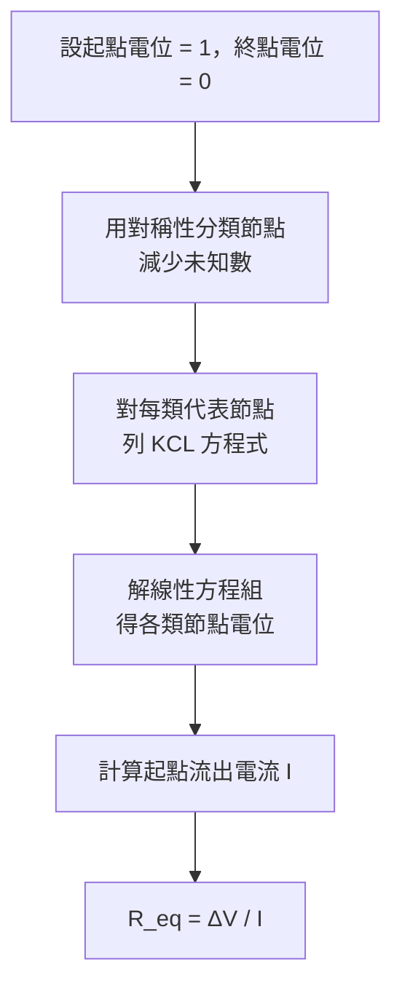

$$\require{physics}$$

<link rel="stylesheet" href="/assets/css/posts-custom.css">

> 《立方晶格等效電阻》系列：**第一篇** ｜ [第二篇](/posts/resistor-cube-2-kirchhoff/) ｜ [第三篇](/posts/resistor-cube-3-symmetry/) ｜ [第四篇](/posts/resistor-cube-4-group-theory/) ｜ [第五篇](/posts/resistor-cube-5-three-configurations/) ｜ [第六篇](/posts/resistor-cube-6-graph-theory/) ｜ [第七篇](/posts/resistor-cube-7-laplacian/) ｜ [第八篇](/posts/resistor-cube-8-infinite-lattice/)

---

一個正方體，12 條邊上各有一顆電阻 $R$。把電源接在**體對角線的兩個頂點**，等效電阻是多少？

{: .light w="480" h="401" }
{: .dark w="480" h="401" }

**圖 1：** 正方體電阻網路全圖。12 條邊的電阻均為 $R$。電源接在體對角線的兩個頂點 $A$ 和 $H$。
{: .fig-caption }

這是一道赫赫有名的競賽物理題，答案是

$$\boxed{R_{\text{eq}} = \frac{5}{6}R}$$

漂亮到令人懷疑——但它確實是對的，而且有不只一種推導方法。這個系列會從最基礎的**節點電壓法**（node voltage method）出發，一路拓展到對稱群與圖 Laplacian。

這篇先把第一層完整走完。

---

## 建立坐標與標記節點

把正方體放進坐標系，每個頂點用三個 0 或 1 的坐標表示。8 個頂點是 $(x, y, z)$，其中 $x, y, z \in \\{0, 1\\}$。

- **起點 A**：$(0,0,0)$，接電源正極，設電位 $V_A = 1$。
- **終點 H**：$(1,1,1)$，接電源負極，設電位 $V_H = 0$。
- **中間 6 個節點**：電位待求。

相鄰節點之間（即恰好有一個坐標不同的兩點之間）有一顆電阻 $R$，共 12 顆。

{: .light w="540" h="380" }
{: .dark w="540" h="380" }

**圖 2：** 正方體頂點的坐標標記：$(0,0,0)$ 至 $(1,1,1)$，三條坐標軸 $x,y,z$ 以箭頭標示。
{: .fig-caption }

---

## 節點電壓法的核心邏輯

要解電路，只需兩件工具：

**歐姆定律（Ohm's law）：** 電阻 $R$ 兩端電位差為 $\Delta V$，通過的電流為

$$I = \frac{\Delta V}{R} = \frac{V_{\text{高}} - V_{\text{低}}}{R}$$

**克希荷夫電流定律（Kirchhoff's current law，KCL）：** 在穩定電路中，每個內部節點流入的電流總和等於流出的電流總和：

$$\sum_{\text{鄰居 }j} \frac{V_j - V_i}{R} = 0 \label{eq1:kcl}$$

也就是說：對每個未知電位的節點 $i$，把它和所有鄰居之間的電流加起來等於零。這樣可以列出恰好足夠的方程式來解出所有未知節點的電位。

（為什麼這兩條定律成立、它們的物理意義是什麼？這是[下一篇](/posts/resistor-cube-2-kirchhoff/)的主題。）

---

## 對稱性：8 個節點只有 4 種

6 個未知節點，理論上要列 6 條方程式——但是可以做得更聰明。

觀察這個電路的幾何結構：把起點 A 和終點 H 固定，其他節點的位置有很強的對稱性。

- **B 型節點**：$(1,0,0)$、$(0,1,0)$、$(0,0,1)$——三個節點在幾何上完全等價，與 A 的距離相同，連接方式相同。把 $x, y, z$ 坐標任意交換，這三個節點會互相映射，卻不影響電路結構。所以它們的電位必然相等，記為 $b$。

- **C 型節點**：$(1,1,0)$、$(1,0,1)$、$(0,1,1)$——同理，與 H 的距離相同，電位必然相等，記為 $c$。

這個「等價節點電位相等」的論證有更嚴格的數學基礎（見[第三篇](/posts/resistor-cube-3-symmetry/)），但物理直覺足以支撐：**如果一個對稱操作讓電路回到完全相同的狀態，它就不能改變任何節點的電位**。

電位分布：

| 節點類型     | 節點                          | 電位 |
| ------------ | ----------------------------- | ---- |
| 起點 A       | $(0,0,0)$                     | $1$  |
| B 型（3 個） | $(1,0,0),\ (0,1,0),\ (0,0,1)$ | $b$  |
| C 型（3 個） | $(1,1,0),\ (1,0,1),\ (0,1,1)$ | $c$  |
| 終點 H       | $(1,1,1)$                     | $0$  |

{: .light w="760" h="428" }
{: .dark w="760" h="428" }

**圖 3：** 12 條邊各有電阻 $R$ 的正方體。節點依對稱性分為 4 類：起點 A、B 型、C 型、終點 H（對稱性的嚴格討論見[第三篇](/posts/resistor-cube-3-symmetry/)）。
{: .fig-caption }

6 個方程式簡化成 2 個未知數。

---

## 列 KCL 方程式

**B 型節點（以 $(1,0,0)$ 為代表）**

$(1,0,0)$ 的三個鄰居是：

$$
(0,0,0) = A, \quad (1,1,0) = C, \quad (1,0,1) = C
$$

KCL：流向 $(1,0,0)$ 的電流總和為零：

$$
\frac{1 - b}{R} + \frac{c - b}{R} + \frac{c - b}{R} = 0
$$

整理（乘以 $R$）：

$$
(1 - b) + 2(c - b) = 0 \implies 3b - 2c = 1 \tag{1}\label{eq1:b-kcl}
$$

**C 型節點（以 $(1,1,0)$ 為代表）**

$(1,1,0)$ 的三個鄰居是：

$$
(1,0,0) = B, \quad (0,1,0) = B, \quad (1,1,1) = H
$$

KCL：

$$
\frac{b - c}{R} + \frac{b - c}{R} + \frac{0 - c}{R} = 0
$$

整理：

$$
2(b - c) - c = 0 \implies 3c - 2b = 0 \tag{2}\label{eq1:c-kcl}
$$

{: .light w="760" h="428" }
{: .dark w="760" h="428" }

**圖 4：** 用對稱性分類後，只要對 B 型與 C 型各選一個代表節點列 KCL；其他同類節點的方程式會完全相同。
{: .fig-caption }

---

## 解方程式

由 $\eqref{eq1:c-kcl}$：

$$
b = \frac{3c}{2}
$$

代入 $\eqref{eq1:b-kcl}$：

$$
3 \cdot \frac{3c}{2} - 2c = 1 \implies \frac{9c}{2} - 2c = 1 \implies \frac{5c}{2} = 1 \implies c = \frac{2}{5}
$$

因此：

$$
b = \frac{3}{5}, \qquad c = \frac{2}{5}
$$

---

## 計算等效電阻

起點 A 連到 3 個 B 型節點，每條邊的電流為

{: .light w="480" h="250" }
{: .dark w="480" h="250" }

**圖 5：** 三個 B 型節點電位相同，所以從 A 流出的三條邊電流也相同，總電流是單條電流的 3 倍。
{: .fig-caption }

$$
I_{\text{每條}} = \frac{V_A - b}{R} = \frac{1 - \frac{3}{5}}{R} = \frac{2}{5R}
$$

從 A 流出的總電流：

$$
I = 3 \times \frac{2}{5R} = \frac{6}{5R}
$$

等效電阻：

$$
R_{\text{eq}} = \frac{\Delta V}{I} = \frac{1}{\frac{6}{5R}} = \boxed{\frac{5R}{6}} \label{eq1:req}
$$

---

## 物理直覺：三層並聯串聯驗算

電流從 A 到 H 必須依序通過三個「層次」，每層有若干條等價的並聯邊：

- **A → B 層**：3 條邊並聯，等效 $\dfrac{R}{3}$。
- **B → C 層**：每個 B 型節點各連 2 個 C 型節點，共 $3 \times 2 = 6$ 條邊並聯，等效 $\dfrac{R}{6}$。
- **C → H 層**：3 條邊並聯，等效 $\dfrac{R}{3}$。

由對稱性知各層電流均勻分布，三層串聯：

$$\frac{R}{3} + \frac{R}{6} + \frac{R}{3} = \frac{2R + R + 2R}{6} = \frac{5R}{6}$$

這與節點電壓法結果完全一致，也是一個直觀的驗算。

{: .light w="760" h="428" }
{: .dark w="760" h="428" }

**圖 6：** 把電位相同的節點合併後，正方體電路等效為 A-B-C-H 四節點的小電路；三段分別對應 $3,6,3$ 條等價邊（「等電位節點可以合併」的嚴格證明見[第三篇](/posts/resistor-cube-3-symmetry/)）。
{: .fig-caption }

---

## 解題流程總結

| 節點類型  | 電位  | 坐標中 1 的個數 |
| --------- | ----- | --------------- |
| A（起點） | $1$   | $0$ 個          |
| B 型      | $3/5$ | $1$ 個          |
| C 型      | $2/5$ | $2$ 個          |
| H（終點） | $0$   | $3$ 個          |

注意電位並不是等間距遞減（$1, \frac23, \frac13, 0$），而是 $1, \frac35, \frac25, 0$。這是因為 B→C 段比 A→B 段有更多電阻可以並聯，所以電位降落較小。

{: .light w="760" h="428" }
{: .dark w="760" h="428" }

**圖 7：** A、B、C、H 的電位依序下降，但下降量不平均；這反映了不同段落的並聯通道數不同。
{: .fig-caption }

> **主要結論**：12 個 $R$ 的正方體電阻網路，體對角線兩端的等效電阻為
>
> $$R_{\text{eq}} = \frac{5}{6}R$$
>
> 對稱性把 8 個未知數壓縮成 2 個，只需解 $2\times 2$ 線性方程組即可得出。
{: .prompt-tip }

> **注意**：在 1×1×1 的立方體中，「坐標中 1 的個數」（即到起點 A 的曼哈頓距離）恰好與節點的等電位類別一一對應——但這只是此特例的巧合，**不是**一般分類依據。在更大的晶格（例如 2×2×2，共 27 個節點）中，曼哈頓距離相同的節點電位不一定相同，必須用[第三篇](/posts/resistor-cube-3-symmetry/)的對稱群軌道來正確分類。
{: .prompt-warning }

---

## 下一步

這個解法有兩個「魔法」步驟：

1. **為什麼可以說等電位節點的電位相等？** 這需要把「對稱操作」說清楚——[第三篇：對稱性幫你少列方程式](/posts/resistor-cube-3-symmetry/)。

2. **KCL 本身為什麼成立？** 它不是定義，而是從電荷守恆推導出來的——[第二篇：克希荷夫定律的物理根源](/posts/resistor-cube-2-kirchhoff/)。

再下一個問題：如果把立方體換成 $2\times2\times2$ 的晶格（27 個節點）呢？方法相同，但要仔細處理更多層次的對稱性。那是系列後續要探討的核心問題。
